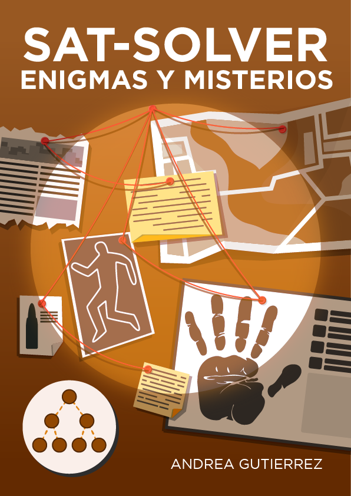
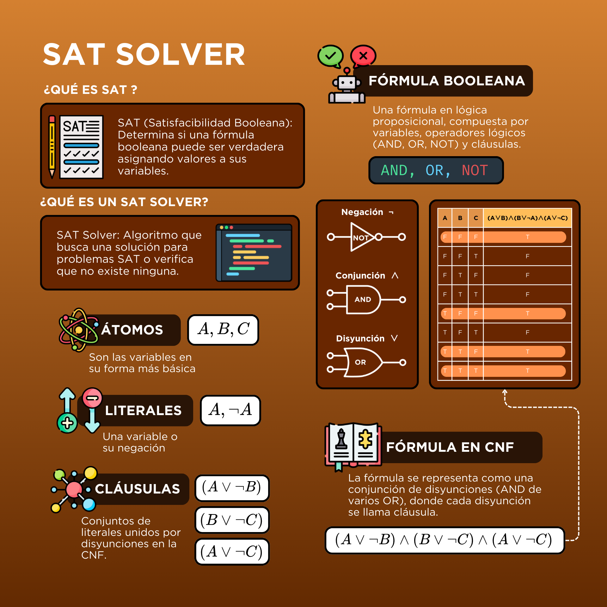
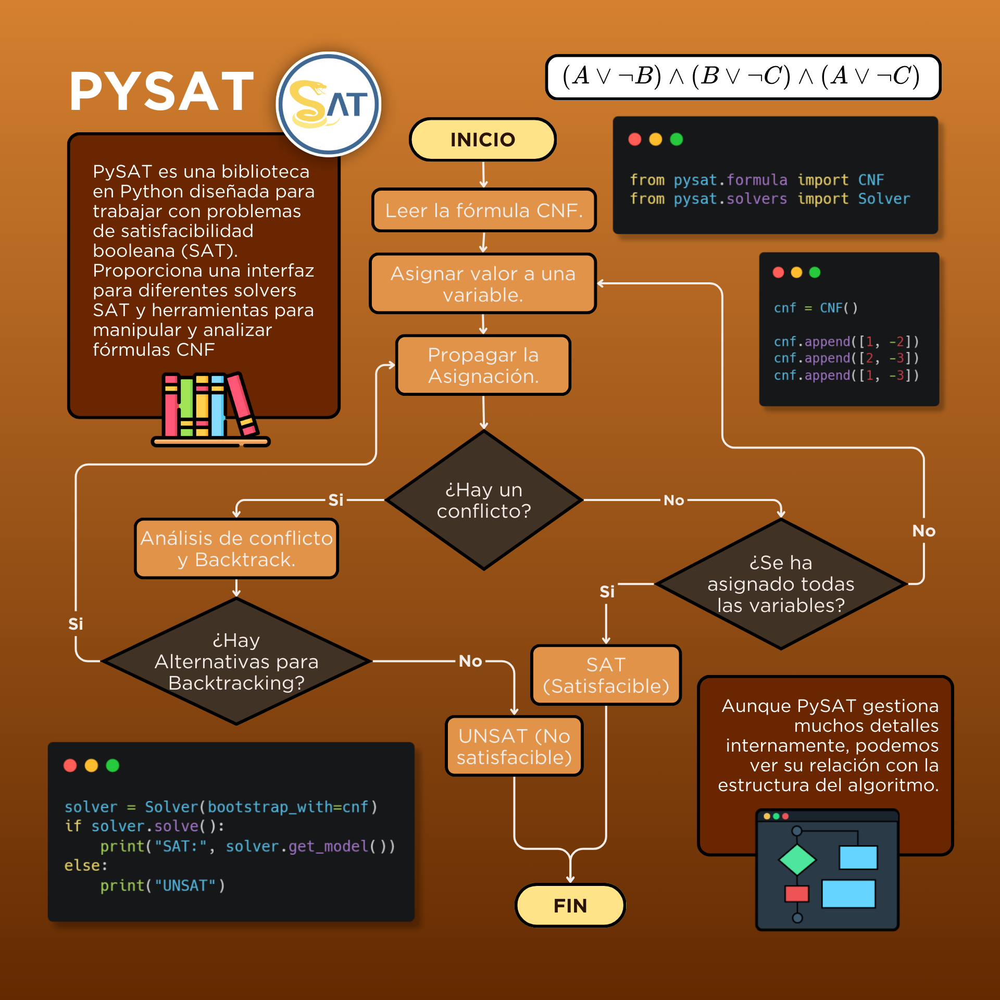
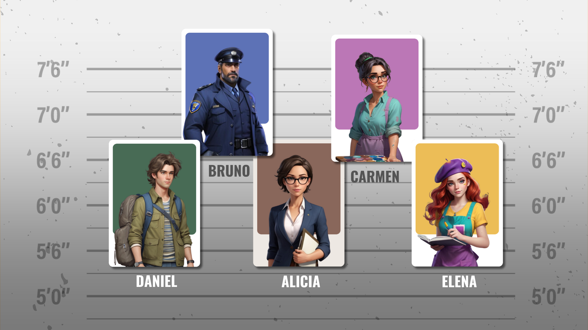
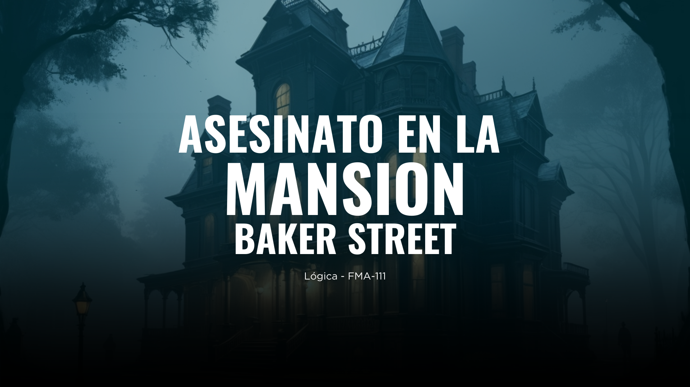
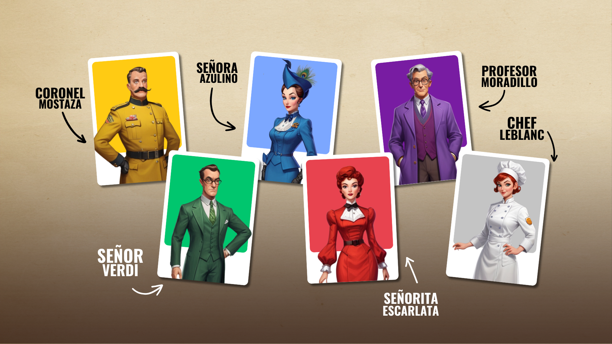
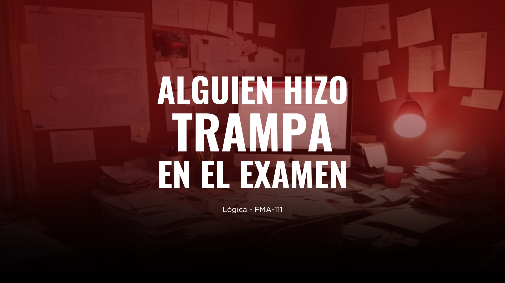

# SAT Solver : Enigmas y Misterios

## ¿Qué es un SAT Solver?

Un SAT solver (Satisfiability Solver) es un software que resuelve problemas de satisfacibilidad booleana. Estos problemas consisten en determinar si existe una asignación de valores (verdadero o falso) a las variables de una fórmula booleana que haga que la fórmula sea verdadera. En otras palabras, el SAT solver busca una solución para una fórmula lógica expresada en forma de cláusulas, si es que existe una.

### ¿Cómo funciona un SAT Solver?

1. **Entrada**: Toma una fórmula booleana en forma normal conjuntiva (CNF), que es una conjunción de cláusulas, donde cada cláusula es una disyunción de literales.
2. **Proceso**:
    - **Heurísticas de Selección**: Utiliza heurísticas para seleccionar qué variables asignar y en qué orden.
    - **Propagación**: Aplica reglas para deducir valores de variables basándose en asignaciones actuales.
    - **Backtracking**: Si una asignación lleva a una contradicción, el solver retrocede y prueba otras posibles asignaciones.
    - **Optimización**: Emplea técnicas avanzadas como la propagación de cláusulas y el aprendizaje de cláusulas para mejorar la eficiencia.
3. **Salida**: El solver devuelve si la fórmula es satisfacible (con una asignación de valores) o insatisfacible (sin ninguna asignación que haga verdadera la fórmula).

## ¿Qué es la biblioteca PySAT?

PySAT es una biblioteca en Python diseñada para trabajar con problemas de satisfacibilidad booleana (SAT). Proporciona una interfaz para diferentes solvers SAT y herramientas para manipular y analizar fórmulas CNF. Es útil para investigadores y desarrolladores que trabajan con problemas de lógica y optimización combinatoria.

# MENÚ PRINCIPAL

**Descripción:**

En este juego de misterio, asumes el rol del detective Hércules Poirot, quien debe resolver intrigantes casos de asesinato y trampa. Cada caso tiene su propio conjunto de personajes y declaraciones que guiarán tu deducción.

**Opciones de Casos:**

1. **El Misterio del Museo** (Fácil)
2. **Asesinato en la Mansión Baker Street** (Intermedio)
3. **Alguien hizo trampa en el Examen** (Avanzado)
4. **Salir**

---

## NIVEL FÁCIL: El Misterio del Museo

### Descripción del Caso

El Misterio del Museo es un juego de deducción lógica en el que los jugadores deben descubrir quién robó una valiosa pintura en una galería de arte. Los jugadores escucharán las declaraciones de los cinco personajes principales del museo, cada uno con sus propias actividades y afirmaciones durante el momento del robo.

### **Objetivo**

El objetivo del juego es determinar quién es el verdadero culpable al analizar las declaraciones de los sospechosos. Los jugadores deben decidir si afirman o niegan cada declaración proporcionada.

**Instrucciones del Juego:**

- El juego comienza con una breve introducción y presentación de los sospechosos.
- Se presentan las declaraciones de cada sospechoso.
- El jugador debe elegir si afirma o niega cada declaración ingresando "a" para afirmar o "n" para negar.
- Basado en las elecciones del jugador, el juego utiliza un SAT solver para determinar la solución.
- El juego presenta al culpable basado en la lógica deducida de las declaraciones.

### **Formulación Lógica del Juego**

El juego utiliza un enfoque de lógica proposicional para deducir quién es el culpable basándose en las declaraciones de los sospechosos. Esta lógica se formula en términos de cláusulas CNF (forma normal conjuntiva) que se resuelven usando un SAT solver.

### **Personajes**

1. **Alicia ($S_1$)** - Curadora del museo.
2. **Bruno ($S_2$)** - Guardián nocturno.
3. **Carmen ($S_3$)** - Restauradora de arte.
4. **Daniel ($S_4$)** - Visitante frecuente.
5. **Elena ($S_5$)** - Estudiante de arte.

### **Declaraciones de los Personajes**

1. **Alicia** - Curadora del museo, niega ser la culpable.
2. **Bruno** - Guardián nocturno, afirma que Carmen no es la culpable.
3. **Carmen** - Restauradora de arte, dice que el ladrón es uno de los visitantes frecuentes.
4. **Daniel** - Visitante frecuente del museo, acusa a Alicia de ser la culpable.
5. **Elena** - Estudiante de arte, afirma que Bruno no es el culpable.

### **Declaraciones en su Forma de Cláusulas**

1. **Alicia:** "No soy la culpable."
    - Si se niega su declaración: $S_1$ es culpable $\rightarrow S_1$
    - Si se afirma su declaración: $S_1$ no es culpable$\rightarrow \neg S_1$
2. **Bruno:** "Carmen no es la culpable."
    - Si se niega su declaración: Carmen es culpable $\rightarrow S_3$
    - Si se afirma su declaración: Carmen no es culpable $\rightarrow \neg S_3$
3. **Carmen:** "El ladrón es uno de los visitantes frecuentes."
    - Si se niega su declaración: Daniel y Elena no son culpables $\rightarrow \neg S_4$ y $\neg S_5$
    - Si se afirma su declaración: Daniel o Elena son culpables $\rightarrow S_4$ o $S_5$
4. **Daniel:** "Alicia es la culpable."
    - Si se afirma su declaración: Alicia es culpable $\rightarrow S_1$
    - Si se niega su declaración: Alicia no es culpable $\rightarrow \neg S_1$
5. **Elena:** "Bruno no es el culpable."
    - Si se niega su declaración: Bruno es culpable $\rightarrow S_2$
    - Si se afirma su declaración: Bruno no es culpable $\rightarrow \neg S_2$

### **Cláusulas de Exclusión Mutua**

Para asegurar que solo uno de los sospechosos es el culpable, se utilizan las siguientes cláusulas:

- Al menos uno es culpable:
    
    $S_1\lor S_2\lor S_3\lor S_4\lor S_5$
    
- Solo uno puede ser culpable:
    
    $(\neg S_1 \lor \neg S_2), (\neg S_1 \lor \neg S_3), (\neg S_1 \lor \neg S_4), (\neg S_1 \lor \neg S_5), \ldots, (\neg S_4 \lor \neg S_5)$
    

Estas cláusulas aseguran que solo una de las variables $S_1$ a $S_5$ puede ser verdadera, es decir, solo un sospechoso puede ser el ladrón.

### **Resolución**

El juego utiliza un SAT solver para resolver el conjunto de cláusulas generado a partir de las respuestas del jugador. El solver determina si hay un modelo que satisface todas las cláusulas y, en caso afirmativo, identifica al culpable.

---

## NIVEL INTERMEDIO: Asesinato en la Mansión Baker Street

### Descripción del Caso

Durante la fiesta de fin de año en la mansión Baker Street, el anfitrión ha sido asesinado. En el momento del crimen, solo seis invitados permanecían en la mansión: el Coronel Mostaza, la Señora Azulino, el Profesor Moradillo, el Señor Verdi, la Señorita Escarlata y la Chef Leblang. Las coartadas y testimonios de estos personajes serán clave para desentrañar el misterio. Cada uno presenta coartadas y declaraciones que deben ser cuidadosamente examinadas para descubrir al culpable.

### **Personajes**

- **Coronel Mostaza ($CM$)**
- **Señora Azulino ($SA$)**
- **Profesor Moradillo ($PM$)**
- **Señor Verdi ($SV$)**
- **Señorita Escarlata ($SE$)**
- **Chef Leblang ($CL$)**

### **Declaraciones**

Según los testimonios:

- Si la Señora Azulino es culpable, entonces la Chef Leblang también lo es, lo que sugiere una posible complicidad entre ambas. Esto podría indicar un motivo común o una conspiración para cometer el crimen.
- La Chef Leblang no es culpable; su coartada es sólida, ya que estaba en la cocina, lejos de la escena del crimen, lo que hace imposible su participación directa en el asesinato.
- El Profesor Moradillo y la Señorita Escarlata están tan interrelacionados que si uno es culpable, el otro también lo es. Sus coartadas y testimonios se respaldan mutuamente, indicando que si uno cometió el crimen, el otro necesariamente participó o fue testigo.
- Uno de los sospechosos debe ser el Coronel Mostaza, el Señor Verdi o el Profesor Moradillo, ya que cada uno tenía motivos sólidos para asesinar al anfitrión:
    - El Coronel Mostaza podría haber tenido un conflicto personal o profesional con el anfitrión.
    - El Señor Verdi podría haber estado motivado por disputas financieras o personales.
    - El Profesor Moradillo podría haber visto el asesinato como una forma de eliminar un obstáculo a sus ambiciones o disputas personales.
- Si el Señor Verdi es culpable, entonces la Señora Azulino también lo es, debido a que fueron vistos interactuando cerca de la hora del crimen y estuvieron cerca del anfitrión antes del asesinato.
- Finalmente, la Señorita Escarlata no es culpable. Ella es la menos beneficiada por la muerte del anfitrión y sufre más las consecuencias de esta situación, por lo que carece de un motivo racional para haber cometido el asesinato.

### **Proposiciones**

- $SA$: La Señora Azulino es culpable del crimen.
- $CL$: La Chef Leblang es culpable del crimen.
- $PM$: El Profesor Moradillo es culpable del crimen.
- $SV$: El Señor Verdi es culpable del crimen.
- $SE$: La Señorita Escarlata es culpable del crimen.
- $CM$: El Coronel Mostaza es culpable del crimen.

### **Formulación de Declaraciones**

- $SA \rightarrow CL = \neg SA \lor CL$ : Si la Señora Azulino es culpable, entonces la Chef Leblang también lo es.
- $\neg CL$ : La Chef Leblang no es culpable.
- $(PM \leftrightarrow SE)= (PM \lor \neg SE) \land (\neg PM \lor SE)$ : El Profesor Moradillo y la Señorita Escarlata están vinculados de tal manera que si uno es culpable, el otro también lo es.
- $CM \lor SV \lor PM$: Uno de los sospechosos debe ser el Coronel Mostaza, el Señor Verdi, o el Profesor Moradillo.
- $SV \rightarrow SA = \neg SV \lor SA$ : Si el Señor Verdi es culpable, entonces la Señora Azulino también lo es.
- $\neg SE$ : La Señorita Escarlata no es culpable.

### **Conjunción de todas las proposiciones:**

$Formula = (\neg SA \lor CL) \land \neg CL \land (PM \lor \neg SE) \land (\neg PM \lor SE) \land (CM \lor SV \lor PM) \land (\neg SV \lor SA) \land \neg SE$

| **CL** | **CM** | **PM** | **SA** | **SE** | **SV** | Formula |
| --- | --- | --- | --- | --- | --- | --- |
| F | F | F | F | F | F | F |
| F | F | F | F | F | T | F |
| F | F | F | F | T | F | F |
| F | F | F | F | T | T | F |
| F | F | F | T | F | F | F |
| F | F | F | T | F | T | F |
| F | F | F | T | T | F | F |
| F | F | F | T | T | T | F |
| F | F | T | F | F | F | F |
| F | F | T | F | F | T | F |
| F | F | T | F | T | F | F |
| F | F | T | F | T | T | F |
| F | F | T | T | F | F | F |
| F | F | T | T | F | T | F |
| F | F | T | T | T | F | F |
| F | F | T | T | T | T | F |
| F | T | F | F | F | F | T |
| F | T | F | F | F | T | F |
| F | T | F | F | T | F | F |
| F | T | F | F | T | T | F |
| F | T | F | T | F | F | F |
| F | T | F | T | F | T | F |
| F | T | F | T | T | F | F |
| F | T | F | T | T | T | F |
| F | T | T | F | F | F | F |
| F | T | T | F | F | T | F |
| F | T | T | F | T | F | F |
| F | T | T | F | T | T | F |
| F | T | T | T | F | F | F |
| F | T | T | T | F | T | F |
| F | T | T | T | T | F | F |
| F | T | T | T | T | T | F |
| T | F | F | F | F | F | F |
| T | F | F | F | F | T | F |
| T | F | F | F | T | F | F |
| T | F | F | F | T | T | F |
| T | F | F | T | F | F | F |
| T | F | F | T | F | T | F |
| T | F | F | T | T | F | F |
| T | F | F | T | T | T | F |
| T | F | T | F | F | F | F |
| T | F | T | F | F | T | F |
| T | F | T | F | T | F | F |
| T | F | T | F | T | T | F |
| T | F | T | T | F | F | F |
| T | F | T | T | F | T | F |
| T | F | T | T | T | F | F |
| T | F | T | T | T | T | F |
| T | T | F | F | F | F | F |
| T | T | F | F | F | T | F |
| T | T | F | F | T | F | F |
| T | T | F | F | T | T | F |
| T | T | F | T | F | F | F |
| T | T | F | T | F | T | F |
| T | T | F | T | T | F | F |
| T | T | F | T | T | T | F |
| T | T | T | F | F | F | F |
| T | T | T | F | F | T | F |
| T | T | T | F | T | F | F |
| T | T | T | F | T | T | F |
| T | T | T | T | F | F | F |
| T | T | T | T | F | T | F |
| T | T | T | T | T | F | F |
| T | T | T | T | T | T | F |

---

## NIVEL AVANZADO: Alguien hizo trampa en el Examen

### Descripción del Caso

"El Tramposo del Examen" es un juego de detectives en el que el jugador debe descubrir quién hizo trampa durante un examen importante. Hay seis estudiantes sospechosos, y cada uno de ellos podría ser el culpable. El objetivo del jugador es identificar al culpable y determinar cómo hizo trampa, utilizando pistas y deducciones basadas en declaraciones que podrían ser ciertas o falsas.

### **Personajes**

- Andrea
- Brisa
- Alan
- Alondra
- Daniel
- Wilmar

### **Trampas**

- Uso del celular (chat GPT)
- Hojas ocultas con respuestas
- Robó el examen un día antes
- Audífono oculto
- Se copió de su compañero/a

### **Propósito del Juego**

### **Pistas para encontrar al culpable**

- Según las pistas, si Brisa está involucrada, entonces Alondra también lo está. Esto sugiere que podrían haber trabajado juntas en la trampa, ya que sus respuestas eran similares.
- Daniel tiene una coartada sólida y no puede ser el responsable; además, dio el examen otro día porque estaba en la biblioteca.
- Alan no es culpable; su comportamiento durante el examen fue impecable y no tiene motivos para engañar.
- No puede ser Wilmar porque al momento del examen estaba en la enfermería.
- Si Andrea es culpable, entonces Brisa también lo es, ya que se encontraron mensajes de texto entre ellas que sugieren colaboración.
- Hay un culpable. Solo hay un culpable.

### **Declaraciones para investigar la trampa utilizada**

- Andrea menciona que no pudo ser con hojas ocultas, ya que antes de ingresar al examen se revisó a todos los estudiantes.
- Brisa dice que si el culpable no copió de un compañero, entonces tuvo que usar otro medio de trampa.
- Melina dice que el culpable no pudo robar el examen un día antes porque el examen se cambió en la mañana.
- Alan dice que si el culpable no copió de un compañero, entonces tuvo que usar un audífono oculto o un celular.
- Brisa dice que el culpable debió copiarle a un compañero porque los pupitres estaban muy cerca y no había acceso a otros medios de trampa.
- Daniel dice que si alguien robó el examen un día antes, entonces esa persona no fue el culpable, ya que el examen se cambió y no fue útil. Por lo tanto, el culpable debe haber sido quien copió de un compañero.
- Wilmar dice que, debido a la dificultad del examen, el culpable debió copiarle a un compañero o usar un celular.
- Alan dice que no pudo ser por el celular, ya que en el lugar donde se hizo el examen no había señal ni conexión.
- Se hizo trampa de alguna forma. Solo hay opción de trampa que se hizo.

### **Proposiciones**

- **Sospechosos**
    - $P_{Al}$: Alan es el culpable.
    - $P_{M}$: Melina es la culpable.
    - $P_{An}$: Andrea es la culpable.
    - $P_{B}$: Brisa es la culpable.
    - $P_{D}$: Daniel es el culpable.
    - $P_{W}$: Wilmar es el culpable.
- **Trampas**
    - $T_{C}$: Uso el celular (chat GPT).
    - $T_{H}$: Tenía hojas ocultas (respuestas, apuntes).
    - $T_{E}$: Se robó el examen un día antes.
    - $T_{A}$: Audífono oculto.
    - $T_{P}$: Se copió de un compañero/a.

### **Formulación de Declaraciones**

### **Pistas**

- $P_{B} \rightarrow P_{Al} = \neg P_{B} \lor P_{Al}$ : Si Brisa está involucrada, entonces Alondra también lo está.
- $\neg P_{D}$: Daniel tiene una coartada sólida y no puede ser el responsable.
- $\neg P_{Al}$: Alan no es culpable.
- $\neg P_{W}$: No puede ser Wilmar porque al momento del examen estaba en la enfermería.
- $P_{An} \rightarrow P_{B} = \neg P_{An} \lor P_{B}$ : Si Andrea es culpable, entonces Brisa también lo es.
- $P_{Al} \lor P_{M} \lor P_{An} \lor P_{B} \lor P_{D} \lor P_{W}$: Hay un culpable entre los sospechosos.
- $(\neg P_{Al} \lor \neg P_{M}) \land (\neg P_{Al} \lor \neg P_{An}) \land (\neg P_{Al} \lor \neg P_{B}) \land (\neg P_{Al} \lor \neg P_{D}) \land (\neg P_{Al} \lor \neg P_{W}) \land (\neg P_{M} \lor \neg P_{An}) \land (\neg P_{M} \lor \neg P_{B}) \land (\neg P_{M} \lor \neg P_{D}) \land (\neg P_{M} \lor \neg P_{W}) \land (\neg P_{An} \lor \neg P_{B}) \land (\neg P_{An} \lor \neg P_{D}) \land (\neg P_{An} \lor \neg P_{W}) \land (\neg P_{B} \lor \neg P_{D}) \land (\neg P_{B} \lor \neg P_{W}) \land (\neg P_{D} \lor \neg P_{W})$ : Solo hay un culpable.

### **Declaraciones**

- $\neg T_{H}$: Andrea menciona que no pudo ser con hojas ocultas.
- $\neg T_{P} \rightarrow (T_{C} \lor T_{H} \lor T_{E} \lor T_{A}) = T_{P} \lor (T_{C} \lor T_{H} \lor T_{E} \lor T_{A})$: Brisa dice que, si el culpable no copió de un compañero, entonces tuvo que usar otro medio de trampa.
- $\neg T_{E}$: Melina dice que el culpable no pudo robar el examen un día antes.
- $\neg T_{P} \rightarrow (T_{A} \lor T_{C}) = T_{P} \lor (T_{A} \lor T_{C})$: Alan dice que, si el culpable no copió de un compañero, entonces tuvo que usar un audífono oculto o un celular.
- $T_{P}$: Brisa dice que el culpable debió copiarle a un compañero.
- $T_{E} \rightarrow T_{P} = \neg T_{E} \lor T_{P}$: Daniel dice que si el culpable robó el examen un día antes, entonces debe haber sido quien copió de un compañero, porque el examen no le hubiera sido útil.
- $T_{P} \lor T_{C}$: Wilmar dice que el culpable debió copiarle a un compañero o usar un celular.
- $\neg T_{C}$: Alan dice que no pudo ser por el celular.
- $T_{C} \lor T_{H} \lor T_{E} \lor T_{A} \lor T_{P}$: Una forma en la que se hizo trampa.
- $(T_{C} \lor T_{H} \lor T_{E} \lor T_{A} \lor T_{P}) \land \neg(T_{C} \land T_{H}) \land \neg(T_{C} \land T_{E}) \land \neg(T_{C} \land T_{A}) \land \neg(T_{C} \land T_{P}) \land \neg(T_{H} \land T_{E}) \land \neg(T_{H} \land T_{A}) \land \neg(T_{H} \land T_{P}) \land \neg(T_{E} \land T_{A}) \land \neg(T_{E} \land T_{P}) \land \neg(T_{A} \land T_{P})$ : Solo hay una opción que se usó para hacer trampa.

### **Restricciones**

- $P \land T$

### **Conjunción de todas las proposiciones**

**Sospechosos**

$FP = (¬P_B ∨ P_Al) ∧ (¬P_D) ∧ (¬P_Al) ∧ (¬P_W) ∧(¬P_An ∨ P_B) ∧ (P_Al ∨ P_M ∨ P_An ∨ P_B ∨
P_D ∨ P_W) ∧ ((¬P_Al ∨ ¬P_M) ∧ (¬P_Al ∨ ¬P_An) ∧ (¬P_Al ∨ ¬P_B) ∧ (¬P_Al ∨ ¬P_D) ∧
(¬P_Al ∨ ¬P_W) ∧ (¬P_M ∨ ¬P_An) ∧ (¬P_M ∨ ¬P_B) ∧ (¬P_M ∨ ¬P_D) ∧ (¬P_M ∨ ¬P_W) ∧
(¬P_An ∨ ¬P_B) ∧ (¬P_An ∨ ¬P_D) ∧ (¬P_An ∨ ¬P_W) ∧ (¬P_B ∨ ¬P_D) ∧ (¬P_B ∨ ¬P_W) ∧
(¬P_D ∨ ¬P_W))$

| **P_Al** | **P_An** | **P_B** | **P_D** | **P_M** | **P_W** | **Formula Personajes** |
| --- | --- | --- | --- | --- | --- | --- |
| F | F | F | F | F | F | F |
| F | F | F | F | F | T | F |
| F | F | F | F | T | F | T |
| F | F | F | F | T | T | F |
| F | F | F | T | F | F | F |
| F | F | F | T | F | T | F |
| F | F | F | T | T | F | F |
| F | F | F | T | T | T | F |
| F | F | T | F | F | F | F |
| F | F | T | F | F | T | F |
| F | F | T | F | T | F | F |
| F | F | T | F | T | T | F |
| F | F | T | T | F | F | F |
| F | F | T | T | F | T | F |
| F | F | T | T | T | F | F |
| F | F | T | T | T | T | F |
| F | T | F | F | F | F | F |
| F | T | F | F | F | T | F |
| F | T | F | F | T | F | F |
| F | T | F | F | T | T | F |
| F | T | F | T | F | F | F |
| F | T | F | T | F | T | F |
| F | T | F | T | T | F | F |
| F | T | F | T | T | T | F |
| F | T | T | F | F | F | F |
| F | T | T | F | F | T | F |
| F | T | T | F | T | F | F |
| F | T | T | F | T | T | F |
| F | T | T | T | F | F | F |
| F | T | T | T | F | T | F |
| F | T | T | T | T | F | F |
| F | T | T | T | T | T | F |
| T | F | F | F | F | F | F |
| T | F | F | F | F | T | F |
| T | F | F | F | T | F | F |
| T | F | F | F | T | T | F |
| T | F | F | T | F | F | F |
| T | F | F | T | F | T | F |
| T | F | F | T | T | F | F |
| T | F | F | T | T | T | F |
| T | F | T | F | F | F | F |
| T | F | T | F | F | T | F |
| T | F | T | F | T | F | F |
| T | F | T | F | T | T | F |
| T | F | T | T | F | F | F |
| T | F | T | T | F | T | F |
| T | F | T | T | T | F | F |
| T | F | T | T | T | T | F |
| T | T | F | F | F | F | F |
| T | T | F | F | F | T | F |
| T | T | F | F | T | F | F |
| T | T | F | F | T | T | F |
| T | T | F | T | F | F | F |
| T | T | F | T | F | T | F |
| T | T | F | T | T | F | F |
| T | T | F | T | T | T | F |
| T | T | T | F | F | F | F |
| T | T | T | F | F | T | F |
| T | T | T | F | T | F | F |
| T | T | T | F | T | T | F |
| T | T | T | T | F | F | F |
| T | T | T | T | F | T | F |
| T | T | T | T | T | F | F |
| T | T | T | T | T | T | F |

**Trampas**

$FT = (¬T_H) ∧ (T_P ∨ T_C ∨ T_H ∨ T_E ∨ T_A) ∧ (¬T_E) ∧ (T_P ∨ T_A ∨ T_C) ∧ (T_P) ∧ (¬T_E ∨ T_P)∧ (T_P ∨ T_C) ∧ (¬T_C)∧(T_C ∨ T_H ∨ T_E ∨ T_A ∨ T_P)∧((T_C ∨ T_H ∨ T_E ∨ T_A ∨ T_P) ∧ ¬(T_C ∧ T_H) ∧ ¬(T_C ∧ T_E) ∧ ¬(T_C ∧ T_A) ∧ ¬(T_C ∧ T_P) ∧ ¬(T_H ∧ T_E) ∧ ¬(T_H ∧ T_A) ∧ ¬(T_H ∧ T_P) ∧ ¬(T_E ∧ T_A) ∧ ¬(T_E ∧ T_P) ∧ ¬(T_A ∧ T_P))$

| **P_Al** | **P_An** | **P_B** | **P_D** | **P_M** | **P_W** | **Formula Trampa** |
| --- | --- | --- | --- | --- | --- | --- |
| F | F | F | F | F | F | F |
| F | F | F | F | F | T | F |
| F | F | F | F | T | F | T |
| F | F | F | F | T | T | F |
| F | F | F | T | F | F | F |
| F | F | F | T | F | T | F |
| F | F | F | T | T | F | F |
| F | F | F | T | T | T | F |
| F | F | T | F | F | F | F |
| F | F | T | F | F | T | F |
| F | F | T | F | T | F | F |
| F | F | T | F | T | T | F |
| F | F | T | T | F | F | F |
| F | F | T | T | F | T | F |
| F | F | T | T | T | F | F |
| F | F | T | T | T | T | F |
| F | T | F | F | F | F | F |
| F | T | F | F | F | T | F |
| F | T | F | F | T | F | F |
| F | T | F | F | T | T | F |
| F | T | F | T | F | F | F |
| F | T | F | T | F | T | F |
| F | T | F | T | T | F | F |
| F | T | F | T | T | T | F |
| F | T | T | F | F | F | F |
| F | T | T | F | F | T | F |
| F | T | T | F | T | F | F |
| F | T | T | F | T | T | F |
| F | T | T | T | F | F | F |
| F | T | T | T | F | T | F |
| F | T | T | T | T | F | F |
| F | T | T | T | T | T | F |
| T | F | F | F | F | F | F |
| T | F | F | F | F | T | F |
| T | F | F | F | T | F | F |
| T | F | F | F | T | T | F |
| T | F | F | T | F | F | F |
| T | F | F | T | F | T | F |
| T | F | F | T | T | F | F |
| T | F | F | T | T | T | F |
| T | F | T | F | F | F | F |
| T | F | T | F | F | T | F |
| T | F | T | F | T | F | F |
| T | F | T | F | T | T | F |
| T | F | T | T | F | F | F |
| T | F | T | T | F | T | F |
| T | F | T | T | T | F | F |
| T | F | T | T | T | T | F |
| T | T | F | F | F | F | F |
| T | T | F | F | F | T | F |
| T | T | F | F | T | F | F |
| T | T | F | F | T | T | F |
| T | T | F | T | F | F | F |
| T | T | F | T | F | T | F |
| T | T | F | T | T | F | F |
| T | T | F | T | T | T | F |
| T | T | T | F | F | F | F |
| T | T | T | F | F | T | F |
| T | T | T | F | T | F | F |
| T | T | T | F | T | T | F |
| T | T | T | T | F | F | F |
| T | T | T | T | F | T | F |
| T | T | T | T | T | F | F |
| T | T | T | T | T | T | F |
